# Resguardo

**Copias de seguridad para empresas pequeñas, inmunes al ransomware y sin tener que confiar en el servidor.** Basado en [restic](https://restic.net).

> **Estado: en desarrollo activo (0.7.x).** La app de escritorio para Windows se usa a diario en producción. Resguardo Server (consola web) y los agentes de Windows y Linux funcionan y se están probando en clientes reales. Las interfaces y los formatos todavía pueden cambiar.
>
> Resguardo es un proyecto independiente; no es un producto oficial de restic.

*[English below](#english).*

## Qué es

- **Resguardo Server:** un programa que instalas en tu propio servidor (Windows, Debian, Ubuntu, un contenedor de Proxmox o Docker). Desde su **consola web** gestionas las copias de todos los equipos de cada cliente: qué se copia y cuándo, retención, verificación, pruebas de restauración, restaurar, avisos y auditoría.
- **Resguardo Agente:** un servicio ligero en cada equipo (Windows y Linux) que hace las copias con restic y se conecta al servidor siempre hacia fuera. Si el servidor desaparece, el equipo sigue copiando solo y se administra con su línea de órdenes.
- **Servidor de copias:** cualquier equipo con el agente puede guardar las copias de los demás (el rest-server oficial en modo **solo añadir**), con un **espejo** cada noche a otro disco o a una nube (Dropbox, conectada desde la consola).
- **La app de escritorio** (Windows): crear, programar, vigilar y restaurar copias sin servidor ni línea de órdenes.

Más: ganchos «antes de copiar» (volcado de SQL Server, carpeta reciente), copia externa a la nube con Object Lock, modo discreto, pausas, cambiar de servidor sin reinstalar.

### Cómo encaja

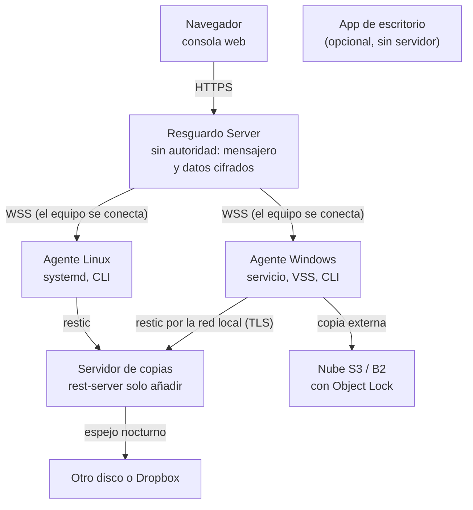

### Capturas

Consola web de Resguardo Server con el servidor simulado (`npm run dev:mock`); las empresas, equipos y personas son inventados. Las que tienen versión oscura se ven en el tema de tu sistema.

**Estado de un cliente:** qué necesita atención, cifras, equipos y repositorios.

<picture>
  <source media="(prefers-color-scheme: dark)" srcset="docs/capturas/estado-oscuro.webp">
  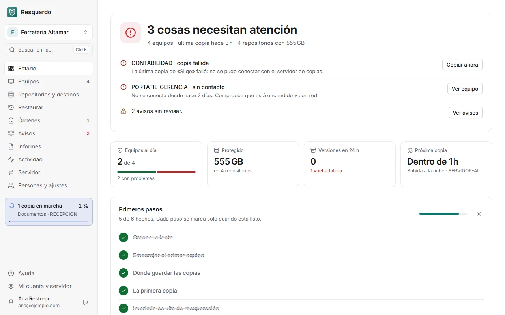
</picture>

**Equipos** con filtros y etiquetas, y la **ficha de un equipo** con su copia en marcha en directo:

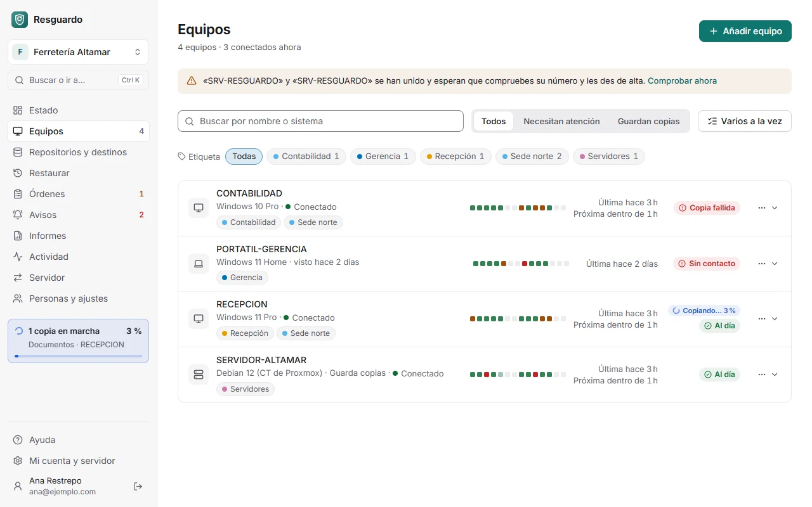

<picture>
  <source media="(prefers-color-scheme: dark)" srcset="docs/capturas/equipo-en-marcha-oscuro.webp">
  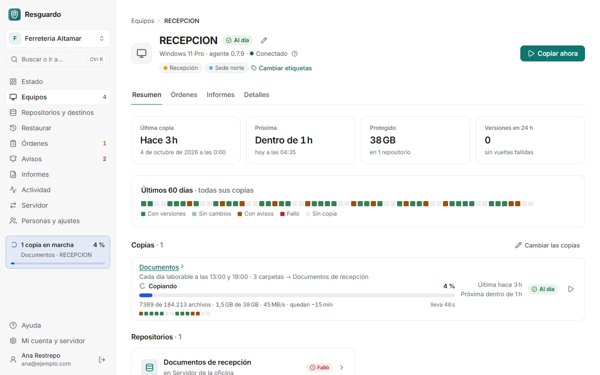
</picture>

**Una copia:** progreso, resumen, los 60 días y su historial.

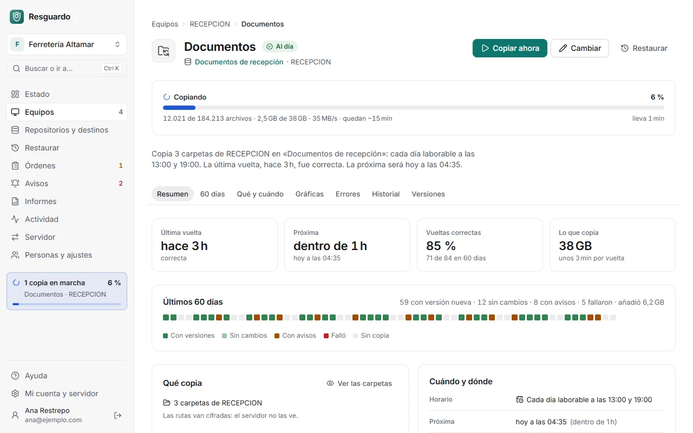

**Un repositorio:** cómo se protegen los datos, salud de la protección, verificación, prueba de restauración y retención; gráficas por versión y las versiones guardadas.

<picture>
  <source media="(prefers-color-scheme: dark)" srcset="docs/capturas/repositorio-oscuro.webp">
  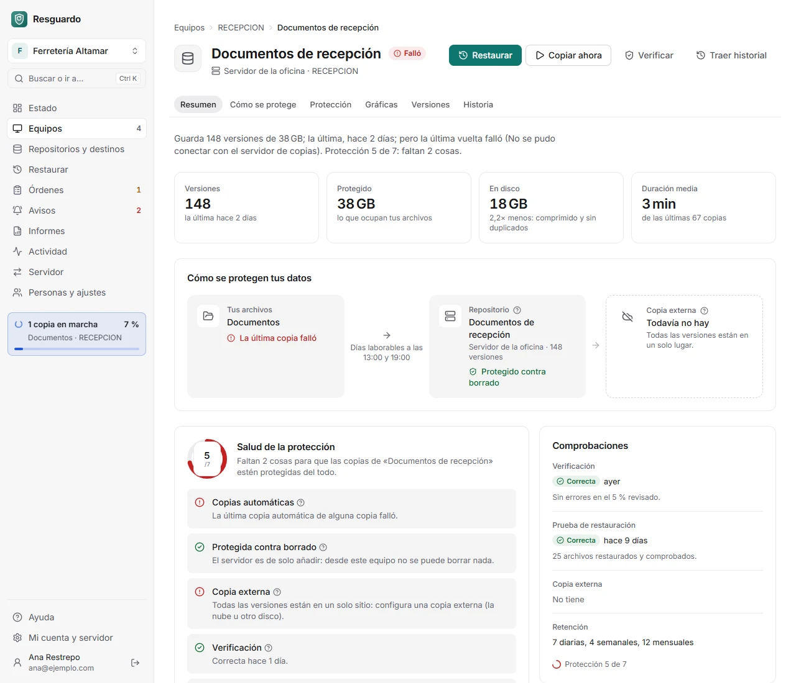
</picture>

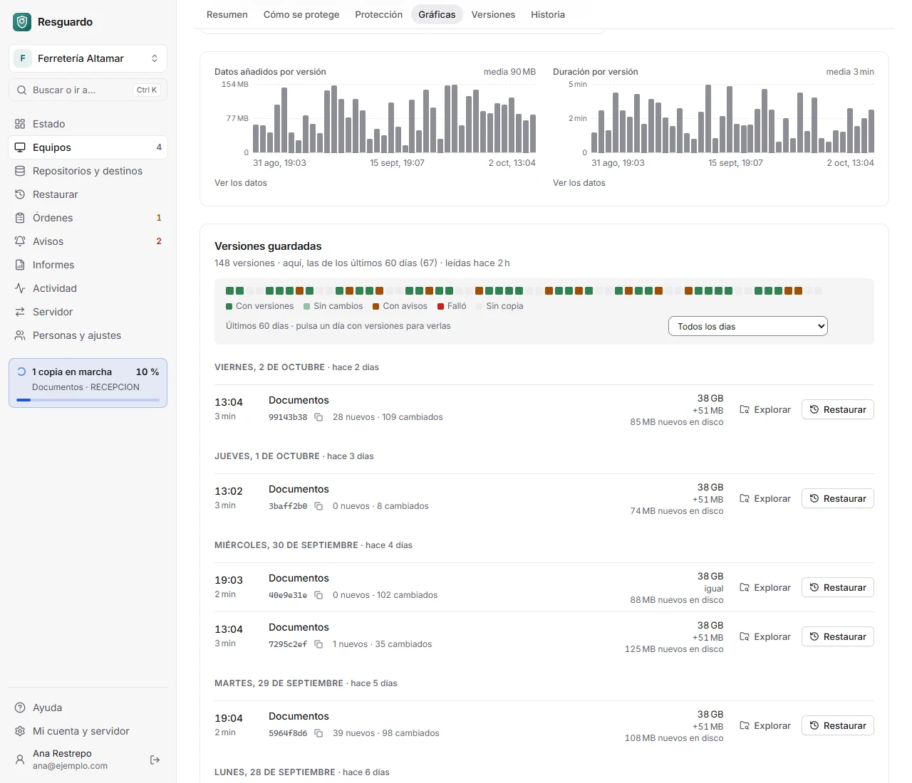

**Restaurar**, paso a paso: equipo, repositorio, contraseña, versión, archivos, dónde y listo.

<picture>
  <source media="(prefers-color-scheme: dark)" srcset="docs/capturas/restaurar-oscuro.webp">
  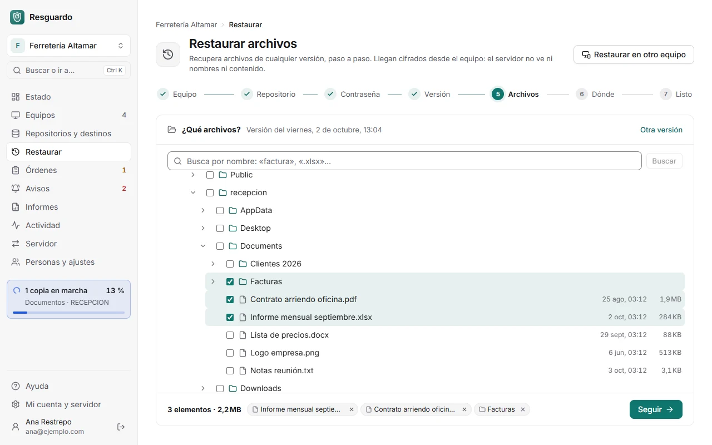
</picture>

**Informes** para el cliente, listos para imprimir o guardar en PDF:

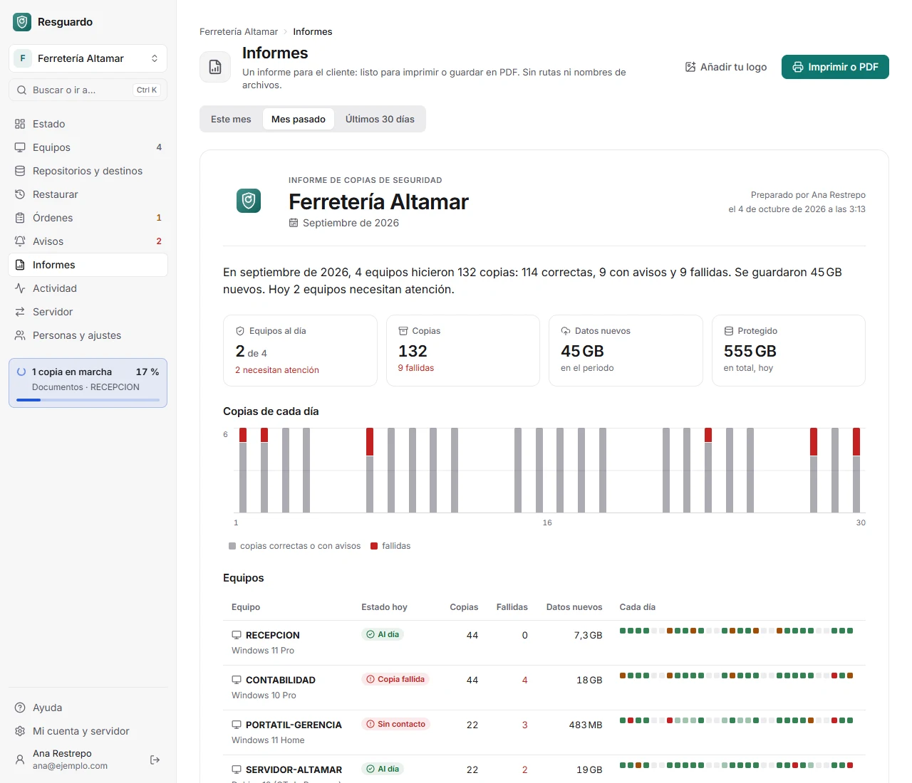

**Añadir un equipo** comparando el número de comprobación en los dos lados:

<picture>
  <source media="(prefers-color-scheme: dark)" srcset="docs/capturas/emparejar-oscuro.webp">
  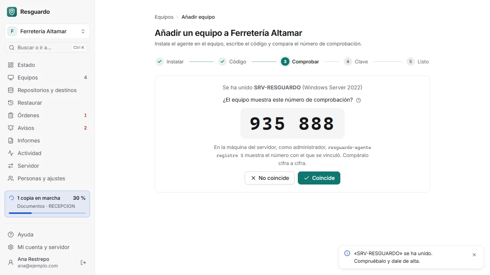
</picture>

**Buscar o hacer** con `Ctrl+K`:

<picture>
  <source media="(prefers-color-scheme: dark)" srcset="docs/capturas/paleta-oscuro.webp">
  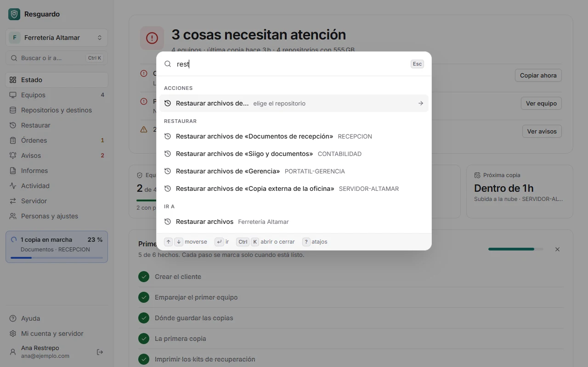
</picture>

**En el móvil:**

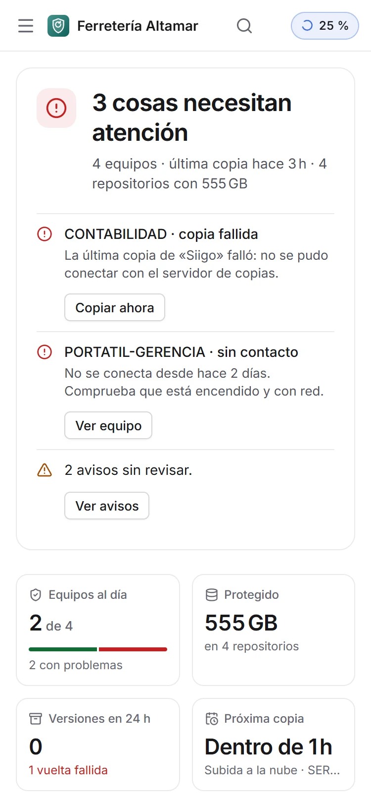 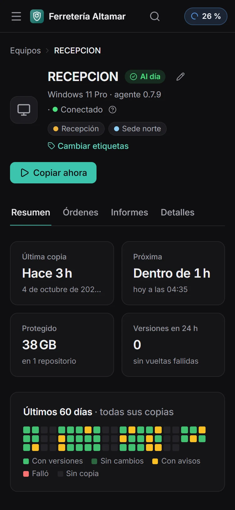

## Cómo protege

**El servidor no manda.** Hay tres llaves, y el servidor no guarda ninguna de las dos que importan:

| Llave | Quién la tiene | Para qué |
|---|---|---|
| **Cuenta de la consola** (contraseña + TOTP) | Cada persona | Ver el estado y pedir cosas **inofensivas**: copiar ahora, verificar, reanudar… |
| **Contraseña del repositorio** | Quien administra ese repositorio | Todo lo que **toca o revela datos**: explorar, restaurar, retención, borrar versiones. |
| **Clave de administración del cliente** | Quien administra el cliente | **Cambios de estructura**: qué se copia, horarios, pausar, equipos, destinos, cambiar de servidor. |

Las dos últimas se escriben en el navegador y viajan **selladas para el equipo** que las comprueba (X25519); el servidor solo hace de mensajero. Un servidor comprometido, o quien robe su base de datos, no puede ordenar nada importante ni leer las copias.

- **restic hace el trabajo:** cifrado y formato de repositorio auditados por años de uso. Resguardo no reinventa la criptografía de las copias.
- **Solo añadir:** el Servidor de copias (rest-server con `--append-only --private-repos`) no deja borrar desde los equipos, y la copia externa en la nube puede ser inmutable (Object Lock). Un equipo infectado no puede destruir sus copias.
- **Lo destructivo espera:** acortar la retención, borrar un repositorio o dar de baja un equipo se aplica tras una espera que hace cumplir el propio equipo (24 h por defecto, nunca menos de 1 h), con avisos y la opción de cancelar.
- **Órdenes firmadas y de un solo uso** (`seq`, `nonce`, caducidad); el agente firma sus respuestas y fija la identidad del servidor al vincularse (código de comprobación en los dos lados).
- **Secretos en el sistema:** DPAPI de máquina en Windows, archivos solo para root en Linux; nada en los argumentos de los procesos.
- **Sin telemetría.**

Detalle y modelo de amenazas: [docs/plataforma.md](docs/plataforma.md) (§3). Política de seguridad y cómo avisar de un fallo: [SECURITY.md](SECURITY.md).

## Empezar

### Windows

1. **Servidor:** ejecuta `Resguardo-Server_…_x64-setup.exe` en el equipo que hará de servidor. Al terminar te muestra la dirección de la consola (`https://EQUIPO:8443/`) y un **código de primer arranque** para crear la cuenta de propietario. Sin ventanas: `/S /PUERTO=8443`.
2. **Consola:** crea un cliente (con su clave de administración) y pulsa **«Añadir equipo»**: te da un código de un solo uso.
3. **Cada equipo:** ejecuta `Resguardo-Agente-setup.exe`, escribe el código y la dirección del servidor y comprueba que el **código de comprobación** coincide en los dos lados. Sin ventanas: `/S /CODE=ABCD-1234 /SERVIDOR=https://servidor:8443`.

Necesitas Windows 10 o Windows Server 2016, o posterior, de 64 bits. Los instaladores aún no están firmados con un certificado de pago: Windows SmartScreen puede avisar; comprueba el SHA-256 publicado.

### Linux (Debian, Ubuntu, CT de Proxmox)

**Servidor** (sin escritorio; se administra desde el navegador de otro equipo):

```sh
sha256sum -c --ignore-missing SHA256SUMS
sudo sh instalar-servidor.sh --paquete ./resguardo-server-x86_64-linux-musl.tar.gz --sin-firma
sudo resguardo-server codigo-inicial     # dirección, huella TLS y código de primer arranque
```

Abre `https://<ip-del-equipo>:8443/` desde otro PC, comprueba la huella del certificado y crea la cuenta de propietario. Paso a paso, para un CT de Proxmox: [docs/servidor-linux.md](docs/servidor-linux.md).

**Agente:**

```sh
sudo apt install ./resguardo-agente_0.7.6_amd64.deb
sudo resguardo-agente vincular ABCD-1234 --servidor https://192.168.1.20:8443
sudo resguardo-agente estado
```

Paso a paso, restic 0.17 y contenedores de Proxmox: [docs/agente-linux.md](docs/agente-linux.md). Las instalaciones de una línea (`instalar-agente.sh`, `instalar-servidor.sh`) comprueban la firma minisign y no instalan nada mientras no se publique la llave de publicación.

### Sin servidor

El agente funciona solo y se administra con su línea de órdenes (`resguardo-agente ayuda`): crear repositorios, copiar ahora, ver versiones, restaurar, exportar e importar la configuración y hacer de Servidor de copias.

## Compilar

Requisitos: Rust estable y Node 22; en Windows, además, las herramientas de compilación de Visual Studio (MSVC) y WebView2. Más detalle en [CONTRIBUTING.md](CONTRIBUTING.md).

```sh
cargo test --workspace                     # pruebas (las de restic, si hay restic)
cargo build --release -p resguardo-servidor --features consola-integrada   # tras compilar consola/ (npm run build)
cargo build --release -p resguardo-agente  # el agente (Windows o Linux)
npm run build:servidor                     # instalador de Resguardo Server (Windows, NSIS)
npm run build:agente                       # instalador de Resguardo Agente (Windows, NSIS)
npm run tauri dev                          # la app de escritorio
```

## Estructura

```
crates/protocolo   sobres sellados, órdenes firmadas, emparejamiento (+ vectores Rust↔JS)
crates/motor       restic, planes, retención, tamaños, ganchos
crates/agente      Resguardo Agente (Windows y Linux) y lo que comparte con la app
crates/servidor    Resguardo Server (API, canal de los agentes, consola embebida)
consola/           consola web de Resguardo Server (SvelteKit)
src/, src-tauri/   app de escritorio (SvelteKit + Tauri)
packaging/         instaladores (NSIS de Windows, paquetes y systemd de Linux, Docker)
fuzz/              fuzzing del protocolo
docs/              diseño, modelo de amenazas, guías y sistema de diseño
```

## Contribuir

Issues y pull requests bienvenidos. Lee [CONTRIBUTING.md](CONTRIBUTING.md), el [CLA](CLA.md) y el [código de conducta](CODE_OF_CONDUCT.md). **Las vulnerabilidades, en privado:** [SECURITY.md](SECURITY.md).

## Licencia

**AGPL-3.0-or-later** ([LICENSE](LICENSE)). Si ofreces Resguardo modificado como servicio en red, debes publicar tus cambios. Las contribuciones se aceptan con el [CLA](CLA.md), que permite ofrecer también licencias comerciales para usos que no encajen con la AGPL. Incluye restic, rest-server (BSD-2-Clause) y rclone (MIT); ver [NOTICE](NOTICE) y [THIRD-PARTY.md](THIRD-PARTY.md).

---

## English

**Backups for small businesses that are immune to ransomware and don't require trusting the server.** Built on [restic](https://restic.net).

> **Status: under active development (0.7.x).** The Windows desktop app is used daily in production; Resguardo Server (web console) and the Windows and Linux agents work and are being piloted. Interfaces and formats may still change. Resguardo is an independent project, not an official restic product.

**What it is:** a self-hosted server with a web console, lightweight agents (Windows service, Linux systemd) that run restic and connect outbound to the server, an optional append-only backup node (official rest-server) with a nightly mirror to another disk or Dropbox, and a Windows desktop app for serverless use.

**Screenshots** (web console, from the built-in simulator; all companies, devices and people are made up — the UI is in Spanish). More, in light and dark and on a phone, under [Capturas](#capturas):

| | |
|---|---|
| [](docs/capturas/estado-claro.webp) Client status: what needs attention | [](docs/capturas/equipo-en-marcha-claro.webp) Device page with a backup running live |
| [](docs/capturas/repositorio-claro.webp) Repository: protection health, checks and retention | [](docs/capturas/repositorio-versiones-claro.webp) Per-version charts and saved versions |
| [](docs/capturas/restaurar-claro.webp) Restore wizard: picking files from a version | [](docs/capturas/emparejar-claro.webp) Adding a device: compare the verification number on both sides |
| [](docs/capturas/informes-claro.webp) Printable monthly report | [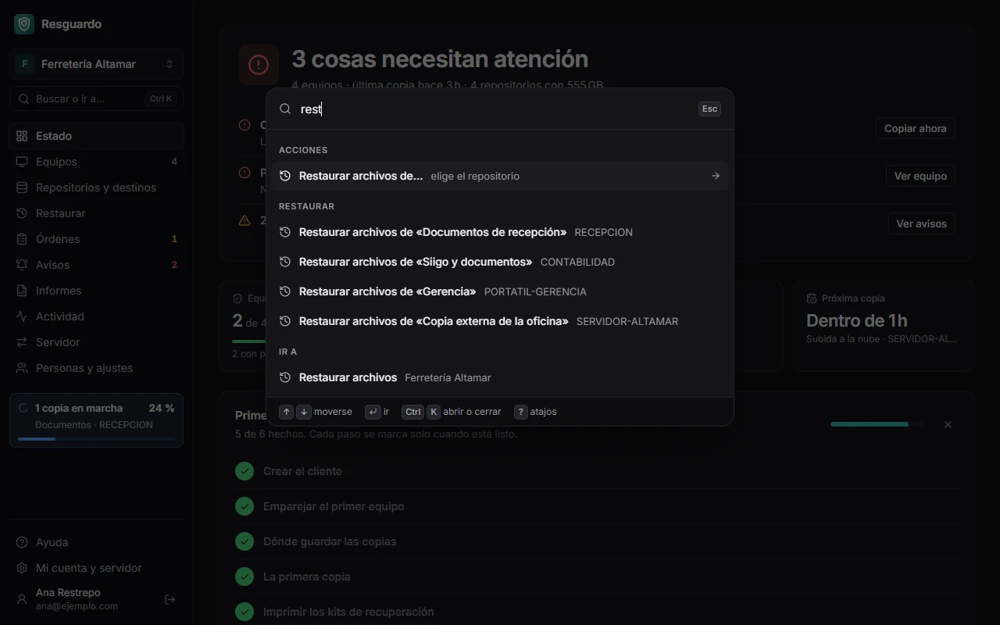](docs/capturas/paleta-oscuro.webp) `Ctrl+K` command palette (dark theme) |

**Security model — the server has no authority.** Three keys: a console account (password + TOTP) for status and harmless requests; the **repository password** for anything that touches or reveals data; the client's **admin key** for structural changes. The last two are typed in the browser, sealed for the agent that verifies them, and never stored by the server. Backup storage is append-only, cloud copies can be immutable (Object Lock), destructive changes are delayed by the agent itself, orders are signed and single-use, and the agent pins the server's identity at pairing (verification code shown on both sides).

**Quick start:** Windows — run the server installer, create a client in the console, click «Añadir equipo», then run the agent installer on each PC with that code. Linux — `apt install ./resguardo-agente_…deb` then `resguardo-agente vincular <code> --servidor https://…`; see [docs/agente-linux.md](docs/agente-linux.md) (Spanish).

**Build:** `cargo test --workspace`; see [CONTRIBUTING.md](CONTRIBUTING.md) (English summary at the end).

Design and threat model: [docs/plataforma.md](docs/plataforma.md) (Spanish; translations planned in [docs/en/](docs/en/)). Security policy: [SECURITY.md](SECURITY.md). The project's working language is Spanish.

**License:** AGPL-3.0-or-later; contributions under the [CLA](CLA.md), with commercial licenses planned for uses that don't fit the AGPL.
